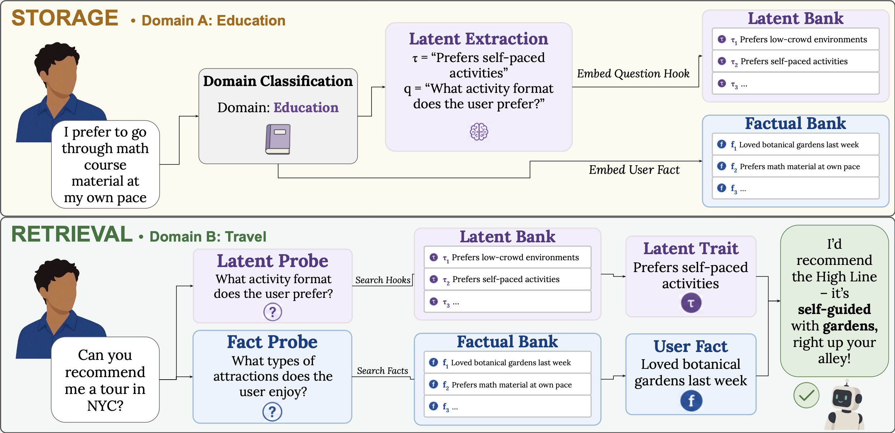

# MemXD

### Transferring Latent Behavioral Traits Across Domains for LLM Personalization

[**Overview**](#overview) ·
[**Setup**](#setup) ·
[**Experiments**](#experiments) ·
[**Repository Structure**](#repository-structure) ·
[**Reproducibility Note**](#reproducibility-note) ·
[**Detailed Experimental Configuration**](#detailed-experimental-configuration)

## Overview

**What is cross-domain personalization?** Users express preferences in domain-specific contexts, but the underlying behavior may remain relevant to decisions in other areas of their lives.

### Key Points

- **Latent trait extraction:** MemXD abstracts domain-specific user statements into transferable behavioral traits.
- **Dual-bank memory:** Factual memories and latent traits are stored and retrieved separately.
- **Question-to-question retrieval:** Latent traits are retrieved by matching generated probing questions against stored question hooks, enabling transfer across semantically distant domains.


<p align="center">
  
</p>

Figure 1: Overview of the **MemXD** pipeline. **(Top)** Storage: a user statement is classified by domain, stored as a factual entry, and if transferable, distilled into a latent trait paired with question hooks that are embedded in the latent bank. **(Bottom)** Retrieval: a query generates latent and factual probes, which search against hooks and statements respectively. Retrieved results are filtered, merged, and provided to the agent to give a personalized response.


## Setup

### 1. Create the Python environment

Download the anonymized repository and extract it locally.

Then create a python environment inside MemXD root.

```bash
conda create -n memxd python=3.13.14
conda activate memxd
pip install -r requirements.txt
```

### 2. Download the benchmark datasets

MemXD is evaluated on:

* **CrossMemBench**, using the Cross-domain Memory Recall Transfer (CMRT) task at noise level 100.
* **PersonaMem**, cross-scenario generalization setting

Download the datasets using our provided script:
```bash
bash download_data.sh
```

### 3. API keys

Set your API key for OpenAI. This is used for both memory processing and evaluation on GPT-4o and GPT-5.4-nano.

```bash
export OPENAI_API_KEY="YOUR_API_KEY"
```

### 4. Ollama Setup

If you would like to run the **Llama 3.2 3B** evaluation, please use Ollama.

1. Install Ollama from the official website:

   https://ollama.com/download

2. Launch the Ollama application and keep it running.

3. Pull the model used in our experiments:

```bash
ollama pull llama3.2:3b
```

4. Verify that the model is installed:

```bash
ollama show llama3.2:3b
```

MemXD connects to the local Ollama server at:

```text
http://localhost:11434
```

Keep Ollama running while executing experiments that use the Llama 3.2 3B backbone.

Our local Llama 3.2 3B experiments were run using Ollama on an Apple M1 Pro chip.

## Experiments

MemXD is evaluated on **CrossMemBench CMRT** at noise level 100 and **PersonaMem Task 7** (cross-scenario generalization).

The repository is pre-configured with the settings used for the experiments reported in the paper. **Each experiment script automatically sets the correct top-k reported in the paper.** A complete breakdown can be found in [Detailed Experimental Configuration](#detailed-experimental-configuration).

### CrossMemBench

Run the CrossMemBench experiments from the repository root:

```bash
bash runcrossmembench.sh
```

This script runs MemXD across the evaluated agent backbones and stores the outputs under:

```text
results/CrossMemBench/
```

The directory contains the individual result files for each evaluated model along with:

```text
analysis.json
```

At the end of the run, the aggregated CrossMemBench metrics are also printed to the terminal.

The final analysis reports both retrieval coverage and end-to-end accuracy. Retrieval coverage is computed by checking whether the gold memory ID from the CrossMemBench data is present among the retrieved memories for each example. Gold memory IDs are stored as custom metadata during insertion and matched against the raw retrieved outputs.

### PersonaMem

Run the PersonaMem experiments from the repository root:

```bash
bash runpersonamem.sh
```

This script runs MemXD on PersonaMem Task 7 across the evaluated agent backbones and stores the individual result files under:

```text
results/PersonaMem/
```

The final accuracy for each model is printed to the terminal at the end of the run. The accuracy is also stored in the corresponding result JSON file.


## Repository Structure

```text
MemXD/
├── assets/                       README assets
├── benchmarks/                   Benchmark data and benchmark-specific files
├── results/                      Experiment outputs
├── src/                          Core MemXD implementation
├── analyze_crossmembench.py      Aggregates CrossMemBench results
├── download_data.sh              Downloads required benchmark datasets
├── judge.py                      Judge model for CrossMemBench
├── llm.py                        Agent wrapper
├── runcrossmembench.py           CrossMemBench experiment runner
├── runcrossmembench.sh           Runs CrossMemBench experiments
├── runpersonamem.py              PersonaMem experiment runner
├── runpersonamem.sh              Runs PersonaMem experiments
├── requirements.txt              Python dependencies
```

## Reproducibility Note
While all experiments are run with temperature 0, LLM outputs are not guaranteed to be fully deterministic. As a result, exact reproduction of the reported numbers is not guaranteed, though reproduced results should be comparable to those reported in the paper.


## Detailed Experimental Configuration

The repository is configured by default with the experimental settings reported in the paper. No benchmark-specific hyperparameter tuning is required.

#### Agent backbone models

```text
GPT-4o
GPT-5.4 nano
Llama 3.2 3B
```

All agent responses are generated with:

```text
temperature = 0
```

#### MemXD retrieval configuration

**CrossMemBench**

```text
Total retrieval budget: 10
Latent memories (k_l):  5
Factual memories (k_e): 5
```

**PersonaMem**

```text
Total retrieval budget: 20
Latent memories (k_l):  15
Factual memories (k_e): 5
```

**The correct retrieval budget for each benchmark is *automatically* set by the experiment scripts**

#### Memory parameters

```text
Latent cosine threshold:  0.45
Factual cosine threshold: 0.27

Maximum question hooks per latent trait: 2

Latent probes per query:  5
Factual probes per query: 5
```
#### Internal Models
```text
Memory processing model: GPT-4o-mini
Embedding model: text-embedding-3-small (OpenAI)
```

All internal MemXD calls for domain classification, latent trait extraction, and probe generation use temperature 0.

Hyperparameters were selected heuristically and held fixed across experiments; no benchmark-specific tuning was performed.

Additional ablation experiments evaluating the contributions of question hooks, probing questions, and retrieval thresholds are reported in the paper.